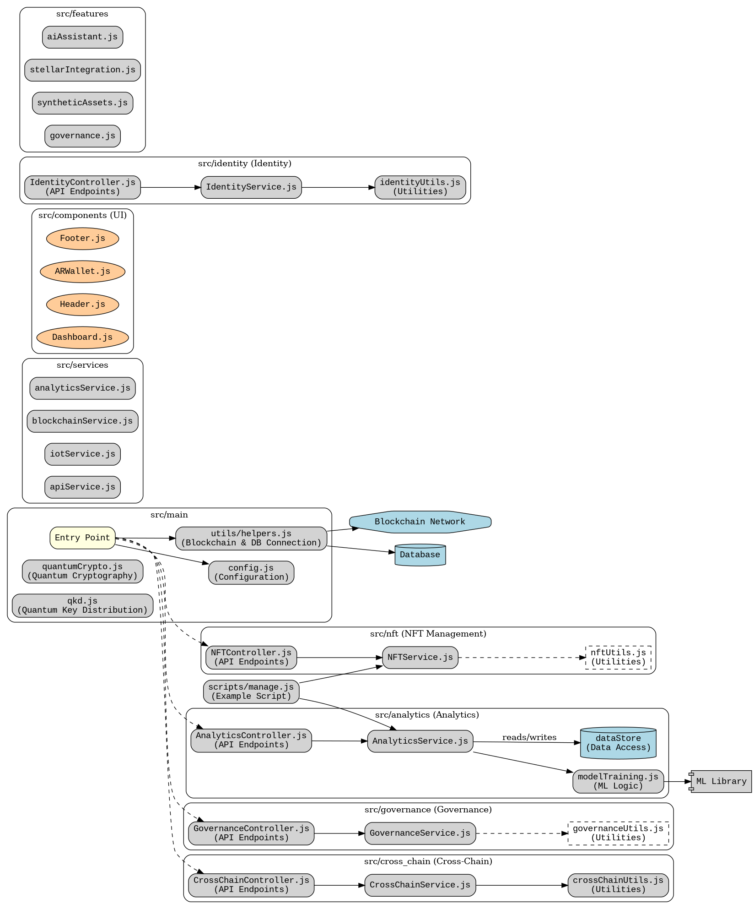

# Quantum Pi System Architecture Overview

## Introduction
The Quantum Pi platform is designed to provide a decentralized financial ecosystem powered by the Pi Coin. This document outlines the key components of the system architecture, including the blockchain layer, smart contracts, application layer, and user interfaces.

## Quantum Pi Diagram

 

## Architecture Components

### 1. Blockchain Layer
- **Consensus Mechanism**: Utilizes a hybrid consensus model combining Proof of Stake (PoS) and Delegated Proof of Stake (DPoS) to ensure security and scalability.
- **Smart Contracts**: Deployed on the Quantum Pi blockchain, these contracts govern the behavior of the Pi Coin, staking mechanisms, and governance protocols.

### 2. Smart Contracts
- **PiCoin.sol**: The main token contract that manages the issuance and transfer of Pi Coins.
- **Governance.sol**: Manages the voting and proposal mechanisms for community governance.
- **Staking.sol**: Implements the staking logic for users to earn rewards.

### 3. Application Layer
- **Backend Services**: Node.js-based services that interact with the blockchain, handle API requests, and manage user sessions.
- **Frontend Application**: A React-based web application that provides a user-friendly interface for interacting with the Quantum Pi ecosystem.

### 4. User Interfaces
- **Web Application**: Accessible via modern web browsers, allowing users to manage their wallets, stake coins, and participate in governance.
- **Mobile Application**: A future enhancement to provide mobile access to the Quantum Pi platform.

## Conclusion
The Quantum Pi architecture is designed for scalability, security, and user engagement, ensuring a robust platform for decentralized finance.
